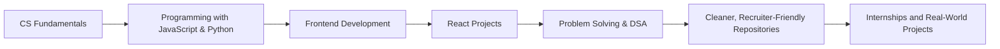

 

---

<h2 align="center">About Me</h2>

  Computer Science student with strong interest in <b>frontend development</b>, clean UI work, and practical software projects.
   
  Focused on <b>JavaScript, TypeScript, React, Python, DSA, and building useful applications</b>.

| Profile Snapshot | Details |
|---|---|
| Degree | B.Tech in Computer Science (in progress) |
| Location | Gorakhpur, Uttar Pradesh |
| Focus | Frontend development & practical CS projects |
| Core Strengths | JavaScript, TypeScript, React, Python, DSA basics |
| Current Goals | Better projects, cleaner repos, internship-ready profile |

---

<h2 align="center">Education</h2>

| Qualification | Institute | Status | Duration |
|---|---|---:|---|
| B.Tech, Computer Science and Engineering | (Your current college name) | Pursuing | (Your start year–present) |
| Schooling | (Your previous school/board) | Completed | (Years) |

---

<h2 align="center">Tech Stack</h2>

  

---

<h2 align="center">Engineering Journey</h2>

---

<h2 align="center">Experience & Work</h2>

- **CODSOFT Internship Tasks**  
  Worked on multiple Java-based tasks and projects as part of the CodSoft internship, improving programming discipline and real-world task understanding.

- **Academic & Personal Projects**  
  Working on web applications and CS coursework projects to improve both frontend skills and core CS understanding.

---

<h2 align="center">Featured Projects</h2>

<table>
  <tr>
    <td width="33%">
      <h3 align="center">EXAM-SPARK-MAIN</h3>
      
<b>TypeScript · Web Project</b>

      

        A project that reflects modern frontend direction with <b>TypeScript</b> and structured code for exam-related workflows.
      

    </td>
    <td width="33%">
      <h3 align="center">Car-Rental-Website</h3>
      
<b>ASP.NET · Web Application</b>

      

        A car rental website project showing <b>multi-page UI design</b> and application-style thinking.
      

    </td>
    <td width="33%">
      <h3 align="center">To-Do-list</h3>
      
<b>JavaScript · Productivity</b>

      

        A simple, practical To-Do app focused on <b>task management, CRUD logic, and clean interaction flow</b>.
      

    </td>
  </tr>
  <tr>
    <td width="33%">
      <h3 align="center">CODSOFT</h3>
      
<b>Java · Internship Tasks</b>

      

        A collection of <b>internship assignments</b>, demonstrating consistency, learning, and hands-on programming.
      

    </td>
    <td width="33%">
      <h3 align="center">More Coming Soon</h3>
      
<b>React · TypeScript</b>

      

        Actively working on <b>new frontend projects</b> to make this section stronger and more recruiter-friendly.
      

    </td>
    <td width="33%">
      <h3 align="center">Open to Ideas</h3>
      
<b>Collaboration</b>

      

        Open to <b>collab and learning</b> on web apps, CS projects, and problem-solving challenges.
      

    </td>
  </tr>
</table>

---

<h2 align="center">GitHub Analytics</h2>

  

---

<h2 align="center">Achievements</h2>

| Achievement | Details |
|---|---|
| GitHub Profile Upgrade | Built a more professional, recruiter-focused GitHub profile with better README and project structure |
| Internship Experience | Completed tasks during **CodSoft** internship, gaining exposure to real assignment-style work |
| Learning Consistency | Continuously practicing **DSA, JS/TS, and frontend development** to improve coding and project quality |

---

<h2 align="center">Current Focus</h2>

---

